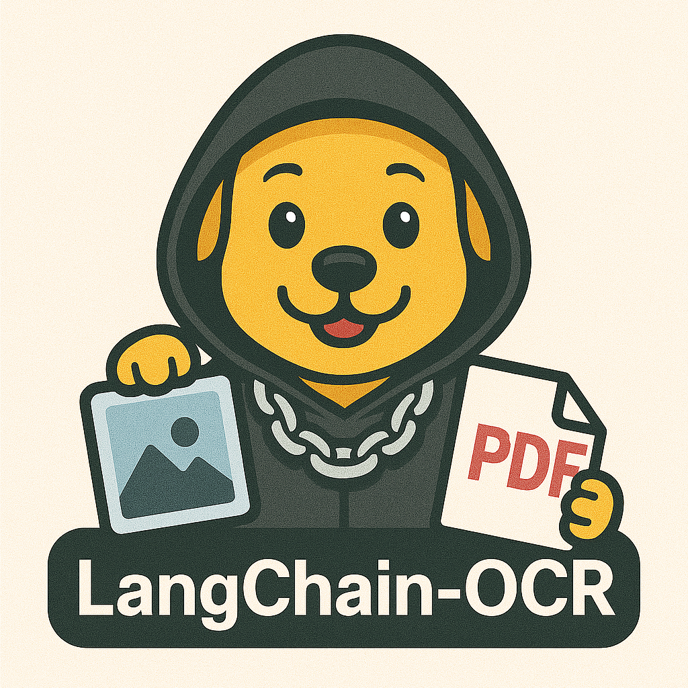

# LangChain-OCR

LangChain-OCR is a cutting-edge OCR solution that converts PDF and image files directly into Markdown using vision LLMs. The project is composed of two main components: the LangChain-OCR library and a FastAPI backend. The library handles the core OCR functionality (can be used via CLI), while the FastAPI backend serves as a user-friendly interface for file uploads and processing. The backend illustates how to use the library, and provides a simple API for developers to integrate OCR capabilities into their applications.


</img>

## Features

- **File Conversion:** Upload images (JPEG, PNG) or PDFs and receive the corresponding Markdown output.
- **Extensible Design:** With dependency injection using [inject](https://pypi.org/project/Inject/), you can easily plug in your own converters or tweak existing ones, exchange the LLM provider etc.
- **Modern API:** Built on FastAPI for efficient asynchronous processing.
- **Tracing:** Integrated with [Langfuse](https://langfuse.com/) for observability and debugging.
- **Language Support:** Configurable language settings allow OCR in multiple languages.
- **LLM provider:** Supports Ollama. Can be easily extended to support other LLM providers.
- **Docker Support:** Easily deployable using Docker and Docker Compose.
- **CLI Support:** Command-line interface for quick and easy file processing.

## Getting Started

### Prerequisites

- Python >= 3.11 (see [api/.python-version](api/.python-version))
- [Poetry](https://python-poetry.org/) for dependency management
- Docker (if you prefer containerized deployment)
- Docker Compose (if you want to use Langfuse and Ollama out of the box)

### Usage

Several options are given to run the project and perform OCR:

1. CLI (see [langchain_ocr_lib/README.md](langchain_ocr_lib/README.md))
2. FastAPI (see [api/README.md](api/README.md))
3. Docker Compose

In the following, the usage with Docker Compose is described.

1. Install Docker Compose (see [Docker Compose installation](https://docs.docker.com/compose/install/))

2. Clone the repository:

```bash
git clone https://github.com/a-klos/langchain-ocr.git
```

3. Navigate to the project directory:

```bash
cd /<<path2repository>>/langchain-ocr
```

Replace `<<path2repository>>` with the path to the cloned repository.

4. Create a .env file (optional):

The configurable environment variables are shown in [.env.template](.env.template). You can copy the template to create your own `.env` file:

```bash
cp .env.template .env
```

5. Build the Docker images and start the containers:

```bash
docker compose up --build
```

6. Pull a vision capable model with Ollama:

```bash
ollama pull <<model_name>>
```

Replace `<<model_name>>` with the name of the model you want to use, e.g., `x/llama3.2-vision:11b-instruct-fp16`. The model should match the one configured.

7. Access the FastAPI interface:

```bash
http://localhost:8001/docs
```

Try the image or PDF upload endpoint.

8. Access the Langfuse UI:

You can access the Langfuse UI at:

```bash
http://localhost:3000
```

You can login with the default credentials:

- **Username:** user
- **Password:** password123

Change the credentials as required.

9. Clean up the Docker containers:

```bash
docker compose down
```
