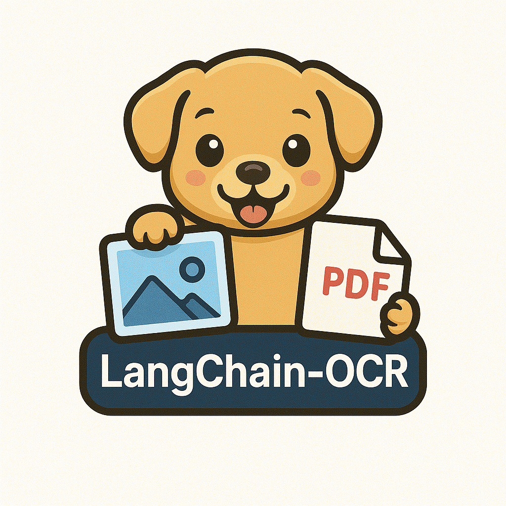

# LangChain-OCR

LangChain-OCR is a cutting-edge OCR solution that converts PDF and image files directly into Markdown. Leveraging FastAPI, Langchain, and modern dependency injection, this project provides a seamless API and robust library for text extraction and conversion — perfect for developers looking to integrate OCR capabilities into their applications.


</img>

## Features

- **File Conversion:** Upload images (JPEG, PNG) or PDFs and receive a fully formatted Markdown output.
- **Modern API:** Built on FastAPI for efficient asynchronous processing.
- **Extensible Design:** With dependency injection using [inject](https://pypi.org/project/Inject/), you can easily plug in your own converters or tweak existing ones.
- **Language Support:** Configurable language settings allow OCR in multiple languages.
- **Integrated Testing:** Built-in support for [pytest](https://docs.pytest.org/en/latest/), ensuring a robust and reliable codebase.

## Getting Started

### Prerequisites

- Python >= 3.11 (see [api/.python-version](api/.python-version))
- [Poetry](https://python-poetry.org/) for dependency management *(optional)*
- Docker (if you prefer containerized deployment)

### Installation

#### Using Poetry

1. Navigate to the `api/` directory:
   ```sh
   cd api